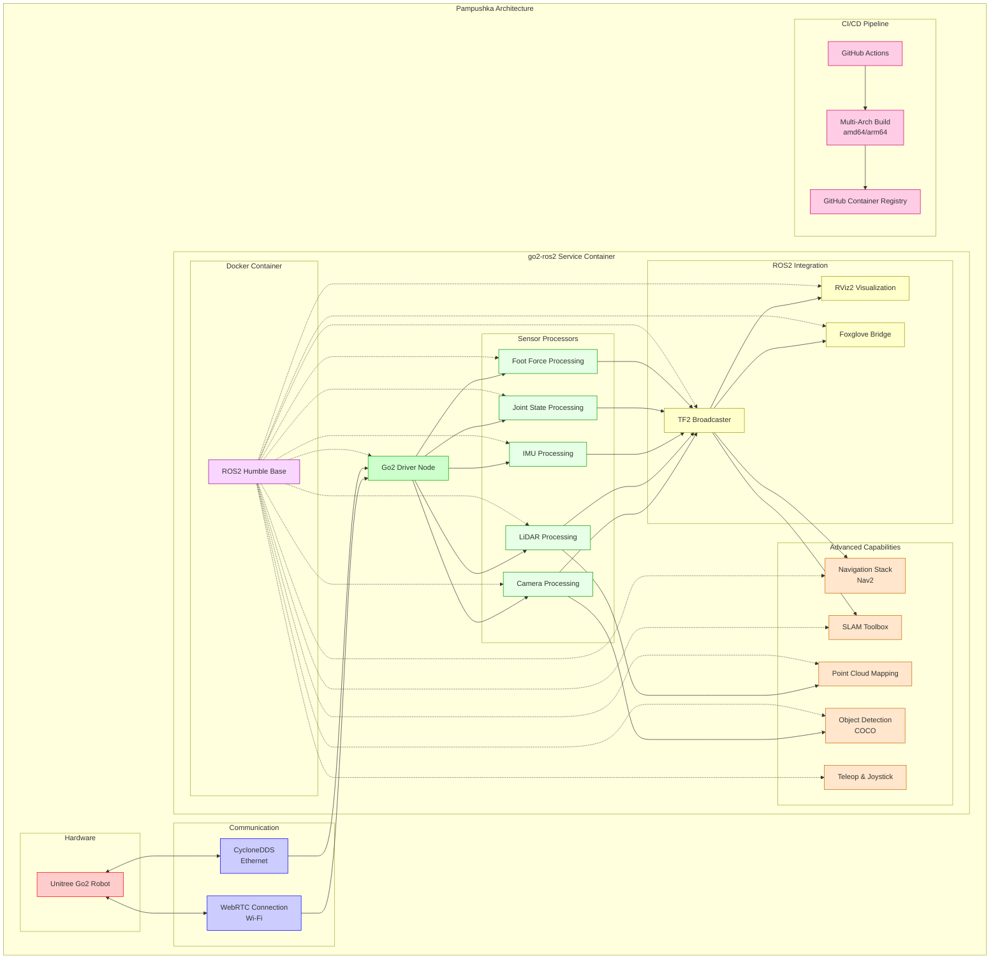

```mermaid
graph TB
    subgraph "Pampushka Architecture"
        subgraph "Hardware"
            UnitreeGo2[Unitree Go2 Robot]
            style UnitreeGo2 fill:#ffcccc,stroke:#ff0000
        end

        subgraph "Communication"
            WebRTC[WebRTC Connection\nWi-Fi]
            CycloneDDS[CycloneDDS\nEthernet]
            style WebRTC fill:#ccccff,stroke:#0000ff
            style CycloneDDS fill:#ccccff,stroke:#0000ff
        end

        subgraph "go2-ros2 Service Container"
            go2_driver[Go2 Driver Node]
            style go2_driver fill:#ccffcc,stroke:#00aa00

            subgraph "Sensor Processors"
                camera_node[Camera Processing]
                lidar_node[LiDAR Processing]
                imu_node[IMU Processing]
                joint_state_node[Joint State Processing]
                foot_force_node[Foot Force Processing]
                style camera_node fill:#e6ffe6,stroke:#009900
                style lidar_node fill:#e6ffe6,stroke:#009900
                style imu_node fill:#e6ffe6,stroke:#009900
                style joint_state_node fill:#e6ffe6,stroke:#009900
                style foot_force_node fill:#e6ffe6,stroke:#009900
            end

            subgraph "ROS2 Integration"
                tf2[TF2 Broadcaster]
                rviz2[RViz2 Visualization]
                foxglove[Foxglove Bridge]
                style tf2 fill:#ffffcc,stroke:#999900
                style rviz2 fill:#ffffcc,stroke:#999900
                style foxglove fill:#ffffcc,stroke:#999900
            end

            subgraph "Advanced Capabilities"
                nav2[Navigation Stack\nNav2]
                slam[SLAM Toolbox]
                object_detection[Object Detection\nCOCO]
                teleop[Teleop & Joystick]
                point_cloud_map[Point Cloud Mapping]
                style nav2 fill:#ffe6cc,stroke:#cc6600
                style slam fill:#ffe6cc,stroke:#cc6600
                style object_detection fill:#ffe6cc,stroke:#cc6600
                style teleop fill:#ffe6cc,stroke:#cc6600
                style point_cloud_map fill:#ffe6cc,stroke:#cc6600
            end

            subgraph "Docker Container"
                ros2_humble[ROS2 Humble Base]
                style ros2_humble fill:#f9d6ff,stroke:#990099
            end
        end

        subgraph "CI/CD Pipeline"
            github_actions[GitHub Actions]
            container_registry[GitHub Container Registry]
            multiarch_build[Multi-Arch Build\namd64/arm64]
            style github_actions fill:#ffcce6,stroke:#cc0066
            style container_registry fill:#ffcce6,stroke:#cc0066
            style multiarch_build fill:#ffcce6,stroke:#cc0066
        end
    end

    %% Connections
    UnitreeGo2 <--> WebRTC
    UnitreeGo2 <--> CycloneDDS
    WebRTC --> go2_driver
    CycloneDDS --> go2_driver

    go2_driver --> camera_node
    go2_driver --> lidar_node
    go2_driver --> imu_node
    go2_driver --> joint_state_node
    go2_driver --> foot_force_node

    camera_node --> tf2
    lidar_node --> tf2
    imu_node --> tf2
    joint_state_node --> tf2
    foot_force_node --> tf2

    tf2 --> rviz2
    tf2 --> foxglove
    tf2 --> nav2
    tf2 --> slam

    lidar_node --> point_cloud_map
    camera_node --> object_detection

    github_actions --> multiarch_build
    multiarch_build --> container_registry

    %% Environment
    ros2_humble -.-> go2_driver
    ros2_humble -.-> camera_node
    ros2_humble -.-> lidar_node
    ros2_humble -.-> imu_node
    ros2_humble -.-> joint_state_node
    ros2_humble -.-> foot_force_node
    ros2_humble -.-> tf2
    ros2_humble -.-> rviz2
    ros2_humble -.-> foxglove
    ros2_humble -.-> nav2
    ros2_humble -.-> slam
    ros2_humble -.-> object_detection
    ros2_humble -.-> teleop
    ros2_humble -.-> point_cloud_map
```
